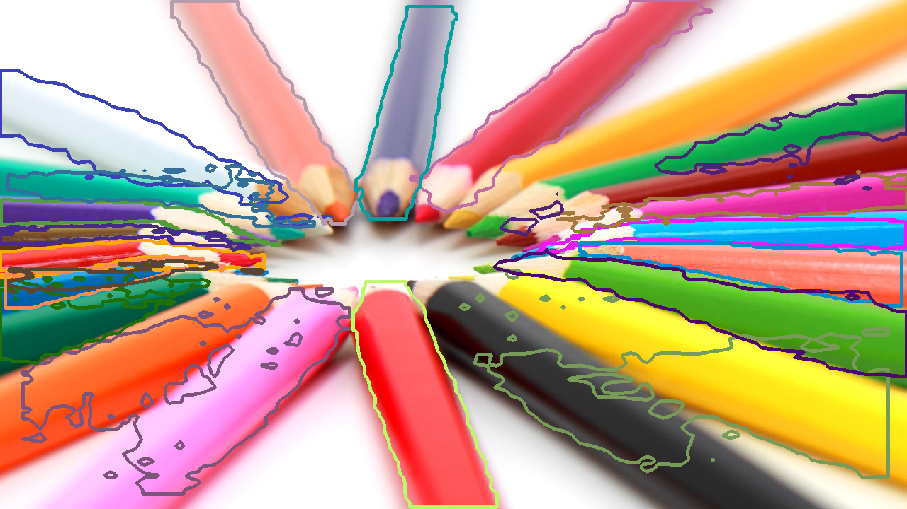
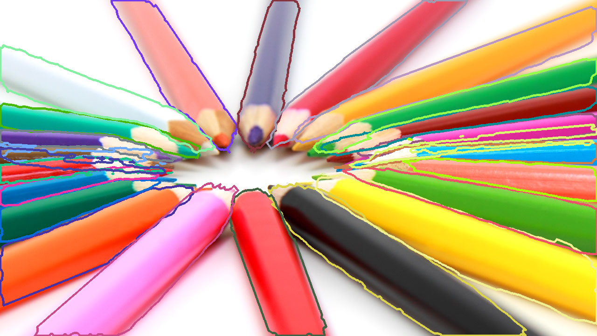
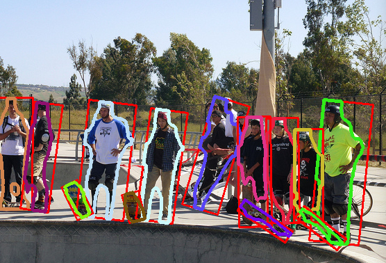
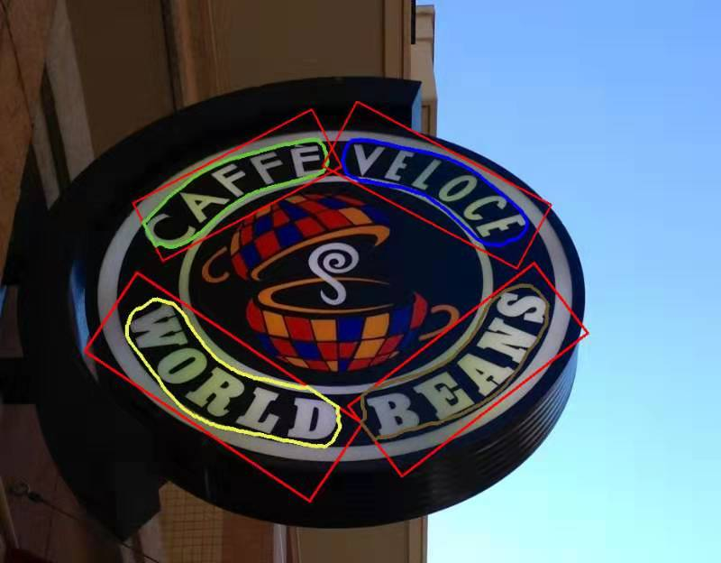

Rotated Mask R-CNN
-----------------


By [Shijie Looi](https://github.com/mrlooi). 

(Paper to be published soon...or not, depends on schedule)

This project is based on [maskrcnn-benchmark](https://github.com/facebookresearch/maskrcnn-benchmark).
Rotation NMS layers were based on [RRPN](https://github.com/mjq11302010044/RRPN).

The Problem With MaskRCNN (and Bounding Boxes)
-------------
Due to bounding box ambiguity, **Mask R-CNN** fails in relatively dense scenes with objects of the same class, particularly if those objects have high bounding box overlap. In these scenes, **both recall (due to NMS) and precision (foreground instance class ambiguity)** are affected.


MaskRCNN takes a bounding box input to output a single foreground (instance) segmentation per class. The hidden assumption here (as is common in many detection networks) is that a good bounding box contains just one object in that class. This is not the case for dense scenes like the pencil image above.

Unfortunately, such scenes are underrepresented in the most popular instance segmentation datasets - MSCOCO, Pascal VOC, Cityscapes. Yet they are not uncommon in many real-world applications e.g. robotics/logistics, household objects i.e. pens/chopsticks, etc. As a result, I've released **a simple, small dataset called PPC - Pens, Pencils, Chopsticks (see below)**, and show the significant difference between Mask R-CNN and Rotated Mask R-CNN in such scenes.

Rotated Mask R-CNN
-------------


**Rotated Mask R-CNN** resolves some of these issues by adopting a rotated bounding box representation.

This repository extends Faster R-CNN, Mask R-CNN, or even RPN-only to work with rotated bounding boxes.

This work also builds on the Mask Scoring R-CNN ('MS R-CNN') paper by learning the quality of the predicted instance masks ([maskscoring_rcnn](https://github.com/zjhuang22/maskscoring_rcnn)).

The repo master branch is fully merged upstream with the latest master branch of [maskrcnn-benchmark](https://github.com/facebookresearch/maskrcnn-benchmark) (as of 25/07/2019)

Results
------------  
**COCO**  
Trained on coco/train2014, evaluated on coco/val2014

| Backbone  | Method | mAP(mask) |
|----------|--------|-----------|
| ResNet-50 FPN | Mask R-CNN | 34.1 |
| ResNet-50 FPN | MS R-CNN | 35.3 |
| ResNet-50 FPN | Rotated Mask R-CNN | 33.4 |
| ResNet-50 FPN | Rotated MS R-CNN | 34.7 |

**PPC (Pens, Pencils, Chopsticks)**
PPC (Pens, Pencils, Chopsticks) dataset: [Link](https://drive.google.com/open?id=1B4jV49KGVJtiZJVxcG11kNzGQKV02NHz)  
Trained on train.json, evaluated on test.json (pens & pencils only, no chopstick class)

| Backbone  | Method | mAP(mask) |
|----------|--------|-----------|
| ResNet-50 FPN | MS R-CNN | 13.2 |
| ResNet-50 FPN | Rotated MS R-CNN | 19.3 |

Additional Features
-----------------
- Soft NMS (Implemented for both bounding box and rotated detections. [Original repo](https://github.com/bharatsingh430/soft-nms))
- Mask IoU head (From [maskscoring_rcnn](https://github.com/zjhuang22/maskscoring_rcnn)) 

TODO
-----------------
- Keypoints for rotated bounding boxes

Install
-----------------
  Check [INSTALL.md](INSTALL.md) for installation instructions.


Prepare Data
----------------
```
  mkdir -p datasets/coco
  ln -s /path_to_coco_dataset/annotations datasets/coco/annotations
  ln -s /path_to_coco_dataset/train2014 datasets/coco/train2014
  ln -s /path_to_coco_dataset/test2014 datasets/coco/test2014
  ln -s /path_to_coco_dataset/val2014 datasets/coco/val2014
```

Configs
---------------
All example configs related to rotated maskrcnn are in **configs/rotated** folder

Pretrained Models
---------------
Pre-trained models (and config) on MSCOCO can be found here:
 - [Rotated MS R-CNN](https://drive.google.com/open?id=1HYER9pFxvg6y43UeqAzu8u1YDazewrns)
 - [MS R-CNN](https://drive.google.com/open?id=1rBmxrW0PqKUKwgWNGDEnEjbupS69DeV0)


Training
----------------
Single GPU Training
```
  python tools/train_net.py --config-file "configs/rotated/e2e_ms_rcnn_R_50_FPN_1x.yaml" SOLVER.IMS_PER_BATCH 2 SOLVER.BASE_LR 0.0025 SOLVER.MAX_ITER 720000 SOLVER.STEPS "(480000, 640000)" TEST.IMS_PER_BATCH 1
```
Multi-GPU Training
```
  export NGPUS=8
  python -m torch.distributed.launch --nproc_per_node=$NGPUS tools/train_net.py --config-file "configs/rotated/e2e_ms_rcnn_R_50_FPN_1x.yaml" 
```

For more details, see README.md in https://github.com/facebookresearch/maskrcnn-benchmark

Testing
----------------
```
  python tools/test_net.py --config-file "configs/rotated/e2e_ms_rcnn_R_50_FPN_1x.yaml" --ckpt checkpoints/rotated/mscoco_msrcnn/model_final.pth  
```
For more details, see README.md in https://github.com/facebookresearch/maskrcnn-benchmark  

Note that detection ("bbox") results are not relevant to Rotated Mask R-CNN, since detections are defined as bounding boxes, while Rotated Mask R-CNN outputs rotated bounding boxes.  

Inference
----------------
```
  python my_tools/infer_demo.py
```
Be sure to change the input values e.g. config_file (.yaml), model_file (.pth), image_dir

Performance
----------------
- Memory: Almost identical to Mask RCNN (with just a few more parameters)
- Speed: slightly slower (~10%) during inference, 30-50% slower during training

Visualizing Rotated RPN Anchors
------------
```
  python my_tools/vis_rpn_anchors.py
```
Can be a useful tool for visualizing base Rotated RPN anchors. Use it to adjust the anchor sizes and ratios (and angles, if needed) for your application. 

Other Examples
-------------




Acknowledgment
-------------
The work was done at [Dorabot Inc](https://www.dorabot.com/).

Citations
---------------
If you find Rotated Mask R-CNN useful in your research, please consider citing:
```
@misc{looi2019rotatedmrcnn,
  author = {Shijie Looi},
  title = {Rotated Mask R-CNN: From Bounding Boxes To Rotated Bounding Boxes},
  year = {2019},
  publisher = {GitHub},
  howpublished = {\url{https://github.com/mrlooi/rotated_maskrcnn}}
}
```
Note that this is not a standard BibTeX citation. 

License
---------------
rotated_maskrcnn is released under the MIT license. See [LICENSE](LICENSE) for additional details.

Thanks to the Third Party Libs
---------------  
[maskrcnn-benchmark](https://github.com/facebookresearch/maskrcnn-benchmark)   
[Pytorch](https://github.com/pytorch/pytorch)   
